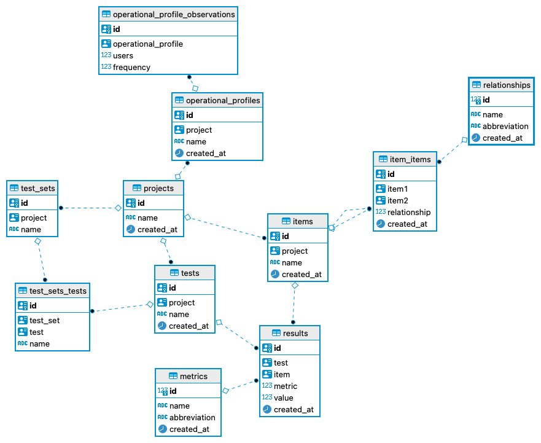

# Analysis

To analyze the data collected through the experiments (see [here](./how_to_use.md)), we load each experiment into a SQLite database. 

The database has the following schema:

The main table is `results`. It stores, for each test and tested item (e.g. a call to `https://www.somewebsite.com/product/add`) a metric (e.g., `response time`) and a value (e.g., `5 seconds`). The range of possible metrics is stored in the table `metric`. Tests are stored in the table `tests` and belong to `projects` and `test sets`. A project can also store `operational profiles`.  `Items` have a name and can be linked indicating the `relation` id.

Once, experiments are available in the `executed` folder, they can be added to the database using the command `store.py`

An example call could be:

- cd ~/pptam-tool/toolchain
- `./store.py ./executed/todolist-fixed-001`

Once all experiments are stored in the database, it is possible to run the analysis.